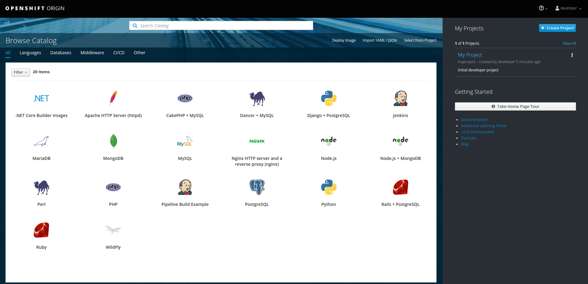
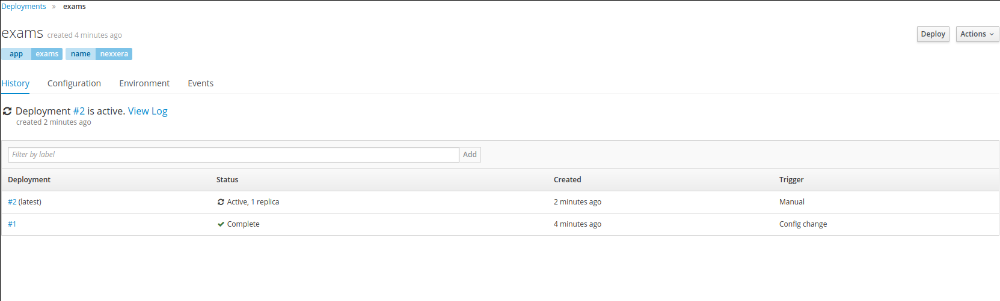
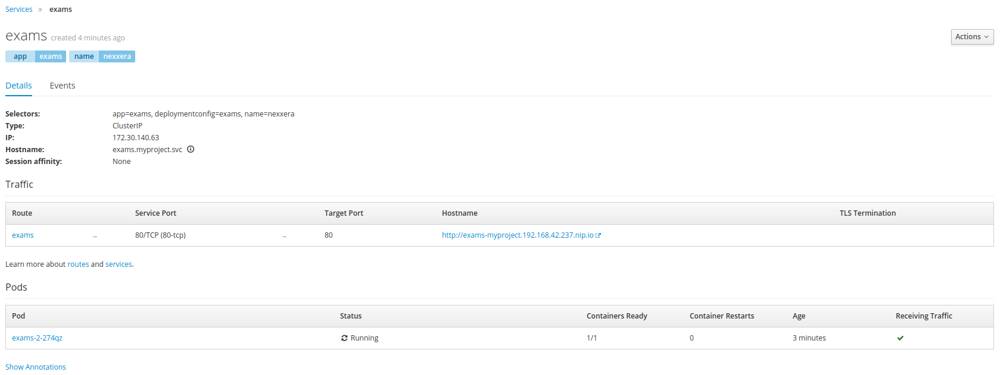
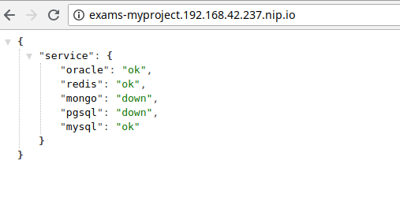

#### Proposta 2

Foi um desafio interessante pois não tenho muita familiaridade com o OpenShift, acredito que existam melhor maneiras e práticas, mas fiz com o meu conhecimento atual dele e de k8s.

Para iniciar o minishift basta seguir o guia da documentação do mesmo, ele cobre desde a instalação dos requisitos necessários até a configuração final.

1.  Inicio o minishift e incluo o cli em meu PATH

    ```text
    $ minishift start
    ...
    OpenShift server started.

    The server is accessible via web console at:
        https://192.168.42.237:8443

    You are logged in as:
        User:     developer
        Password: <any value>

    To login as administrator:
        oc login -u system:admin

    -- Exporting of OpenShift images is occuring in background process with pid 6004.
    ```

    ```bash
    $ eval $(minishift oc-env)
    ```

2.  Utilizei uma imagem a partir do nginx com alpine para reduzir tamanho da imagem, onde substituo o arquivo default.conf para responder o json solicitado

    ```Dockerfile
    ### Dockerfile
    FROM nginx:stable-alpine

    COPY default.conf /etc/nginx/conf.d/default.conf

    EXPOSE 80
    ```

        ### default.conf
        server {
            listen       80;
            server_name  localhost;

            location / {
                default_type application/json;
                return 200 '{"service": {"oracle": "ok", "redis": "ok", "mongo": "down", "pgsql": "down", "mysql": "ok"}}';
            }
        }

3.  Fiz o build e dei push para meu registry do Docker:

    ```bash
    $ docker build -t lucasmdrs/exams:q2 .
    $ docker push lucasmdrs/exams:q2
    ```

4.  Por a minha imagem utilizar o usuário root, será necessário adicionar permissões extras, para isso faço login como admin, adiciono minha imagem e adiciono as permissões

    ```bash
    oc login -u system:admin
    oc new-app lucasmdrs/exams:q2 -l name=exams
    oc  adm policy add-scc-to-user anyuid -z default
    ```

5.  Acessando o console (<https://192.168.42.237:8443>) eu refaço o deploy para efetivar as alterações
    
    

6.  Em serviços eu seleciono o serviço que criei e adiciono uma nova rota para acessá-lo
    

    
